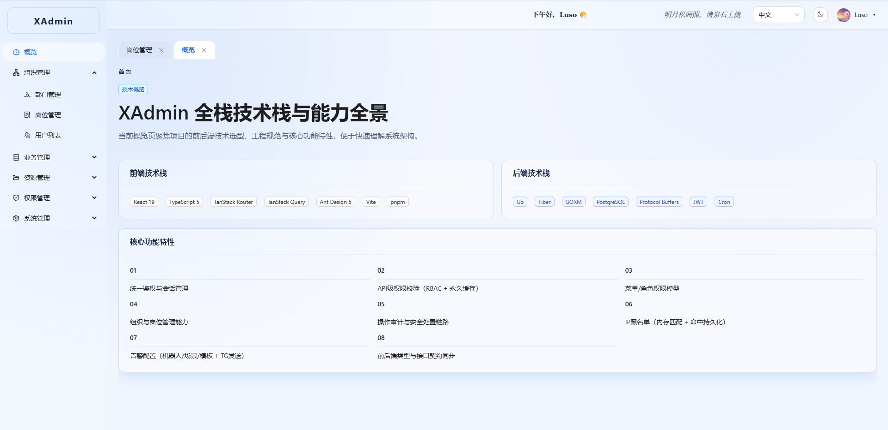
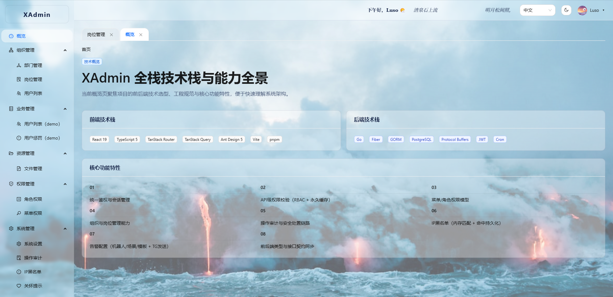

<p align="center">
  <h1 align="center">XAdmin</h1>
  <p align="center">开箱即用的企业级后台管理系统，前后端分离架构，支持多语言（中/英）</p>
</p>

<p align="center">
  
  
  
  
  
  
</p>

<p align="center">
  <a href="https://xadmin-tan.vercel.app">🌐 在线体验</a>
</p>

<p align="center">
  
</p>
<p align="center">
  
</p>

---

## ✨ 功能概览

### 🔐 认证与安全

- JWT Token 认证，支持多设备会话管理
- IP 黑名单（支持 CIDR 段封禁）
- 操作审计日志（含 IP 归属地解析）
- HTTPS 自动证书签发（ACME / Let's Encrypt）

### 👥 组织架构

- 多级部门树形管理
- 岗位管理
- 用户管理（支持批量操作）

### 🛡️ 权限体系

- RBAC 角色权限模型（用户 → 岗位 → 角色 → 权限）
- 细粒度 API 权限拦截（基于 permission_key）
- 前端动态菜单与路由守卫

### 📁 资源管理

- 文件上传与管理（图片 / 语音 / 视频 / 文档 / 压缩包）
- 本地存储

### ⚙️ 系统管理

- 系统设置（站点信息、时区等）
- 关怀提示（登录后公告）
- 告警机器人（Webhook 通知）
- 操作审计（请求追踪、TraceID 筛选）

### 🌐 国际化

- 前后端完整 i18n 支持（中文 / English）
- 后端错误消息多语言返回

---

## 🏗️ 技术栈

| 层级        | 技术                                                                                                           |
|-----------|--------------------------------------------------------------------------------------------------------------|
| **前端**    | React 18 · TypeScript · Vite · Ant Design · TanStack Query · TanStack Router · Zustand · Zod · Framer Motion |
| **后端**    | Go · Fiber · GORM · Protobuf · JWT · Zap · Viper · CertMagic                                                 |
| **数据库**   | PostgreSQL · Redis                                                                                           |
| **工具链**   | pnpm · ESLint · Prettier · Husky · Commitlint · Vitest · Storybook                                           |

详细技术文档：

- 📖 [前端开发规范](p_frontend/AGENTS.MD)
- 📖 [后端开发规范](p_backend/AGENTS.MD)

---

## 📂 项目结构

```
xadmin/
├── p_backend/              # Go 后端服务
│   ├── cmd/server/         # 服务入口
│   ├── internal/           # 业务代码（handler/service/repo/model）
│   ├── pkg/                # 公共包（auth/db/i18n/logger）
│   ├── proto/              # Protobuf 定义与生成代码
│   ├── config/             # 配置文件（dev/prod）
│   ├── docs/               # API 文档 & 数据库 SQL
│   ├── test/               # API 集成测试
│   └── Makefile            # 常用命令
├── p_frontend/             # React 前端
│   ├── src/
│   │   ├── pages/          # 页面组件
│   │   ├── services/       # API 层
│   │   ├── components/     # 通用 UI 组件
│   │   ├── store/          # 状态管理
│   │   ├── i18n/           # 国际化
│   │   └── hooks/          # 自定义 Hooks
│   ├── openapi/            # OpenAPI 契约
│   └── package.json
└── AI_TODO.md              # AI 协作任务清单
```

---

## 🤖 AI 协作开发模式

本项目采用 **AI + 人工协作** 的开发模式，通过 `AI_TODO.md` 管理任务：

- AI 按照 `AGENTS.MD` 中定义的开发规范自主完成编码
- 遵循严格的分层架构：`Proto → Handler → Service → Repo → Docs → Test`
- 每次交付包含完整的代码、文档、测试
- 人类负责需求定义、架构决策和最终验收

这种模式让开发效率提升数倍，同时保证代码质量和规范一致性。

---

## 🚀 快速开始

### 环境要求

- Go 1.25+
- Node.js 22+（见 `p_frontend/.nvmrc`）
- pnpm 10+
- PostgreSQL 16+
- Redis 3+
- protoc（Protobuf 编译器）

### 后端启动

```bash
cd p_backend

# 1. 并修改配置
vim config/dev/app.yaml  # 修改数据库/Redis 连接信息

# 2. 初始化数据库
make execsql ENV=dev

# 3. 生成 Protobuf + 编译 + 启动
make run ENV=dev
```

### 前端启动

```bash
cd p_frontend

# 1. 安装依赖
pnpm install

# 2. 生成 API 类型
pnpm gen:types

# 3. 启动开发服务器
pnpm dev
```

访问 http://localhost:5173 即可使用。

---

## 📦 部署

### 后端部署

```bash
cd p_backend

# 编译
go build -o xadmin ./cmd/server/main.go

# 配置生产环境
# 创建 config/prod/app.yaml（参考 config/dev/app.yaml）
# 设置数据库、Redis、JWT Secret、ACME 证书等

# 启动
APP_ENV=prod ./xadmin

# 或者使用 makefile 快速启动/重启
make run ENV=prod
```

后端支持 ACME 自动 HTTPS 证书签发，配置 `domain_cert` 即可自动申请和续期 TLS 证书。

### 前端部署

```bash
cd p_frontend

# 构建生产包
pnpm build

# dist/ 目录部署到任意静态服务器（Nginx / Vercel / Cloudflare Pages）
```

项目已包含 `vercel.json`，可直接部署到 Vercel。

## 🔧 常用命令

### 后端

```bash
make run ENV=dev        # 启动开发服务器
make verify             # 全量校验（fmt + test + vet + docs）
make verify-fast        # 快速校验
make pb                 # 生成 Protobuf 代码
make execsql ENV=dev    # 执行数据库 SQL
make showtable TABLE=xx # 查看表结构
```

### 前端

```bash
pnpm dev                # 开发服务器
pnpm build              # 生产构建
pnpm check:all          # 全量检查（lint + typecheck + test + build）
pnpm gen:types          # 从 OpenAPI 生成类型
pnpm storybook          # 组件文档
```

---

## 📄 License

[MIT](LICENSE)

---

## 🙏 致谢

- [Fiber](https://gofiber.io/) - Express-inspired Go web framework
- [Ant Design](https://ant.design/) - Enterprise-class UI design language
- [TanStack](https://tanstack.com/) - High-quality open-source software for web developers
