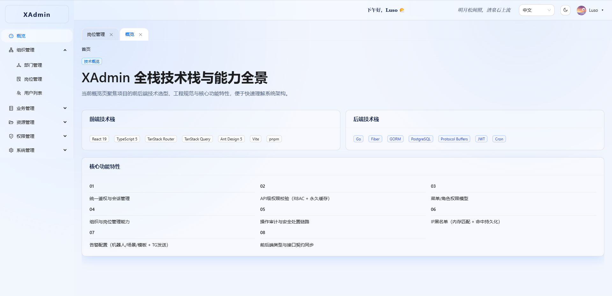
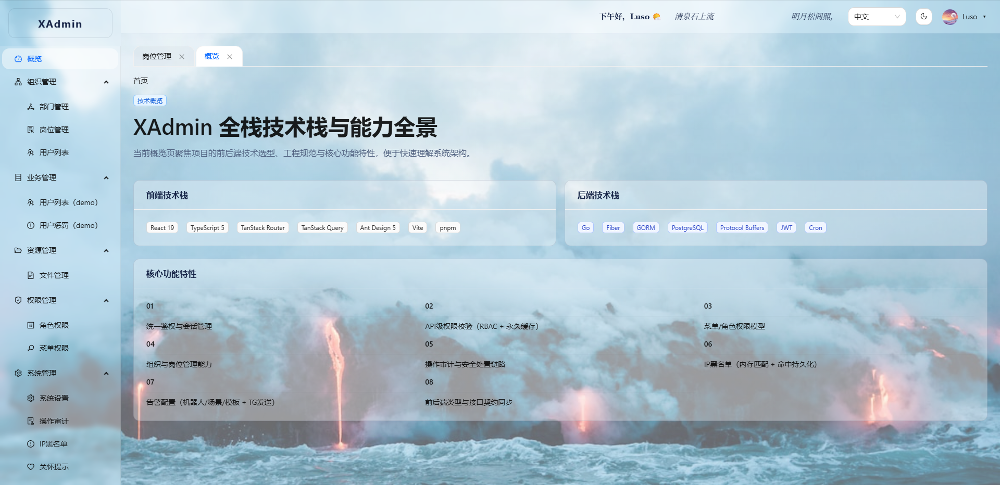

<p align="center">
  <h1 align="center">XAdmin</h1>
  <p align="center">开箱即用的企业级后台管理系统，前后端分离架构，支持多语言（中/英）</p>
</p>

<p align="center">
  
  
  
  
  
  
</p>

<p align="center">
  <a href="https://xadmin-bay.vercel.app">🌐 在线体验</a>
</p>

<p align="center">
  
</p>
<p align="center">
  
</p>

---

## ✨ 功能概览

### 🔐 认证与安全

- JWT Token + 数据库会话，支持多设备登录、注销其他会话和管理员强制下线
- 用户、部门、岗位、角色或密码变化后实时撤销受影响会话
- 账号级单点登录设置与登录审计
- IP 黑名单（支持 CIDR 段封禁）
- 操作审计日志（含 IP 归属地解析）
- HTTPS 自动证书签发（ACME / Let's Encrypt）

### 👥 组织架构

- 多级部门树形管理，成员数与岗位数实时统计
- 岗位管理：岗位角色、编制/在岗人数、保护状态和管理层级
- 用户管理：资料、调岗、状态、密码重置、会话查看、CSV 导入导出及批量转岗
- 用户个人资料返回所属部门、岗位和关联角色

### 🛡️ 权限体系

- RBAC 岗位继承模型：`用户 → 岗位 → 角色 → 菜单/API 权限`
- 三轴权限判断，避免把业务能力与组织层级混为一谈：
  - **动作权限**：使用稳定的 `permission_key` 判断能否调用功能或接口
  - **目标管理权**：使用岗位 `management_rank` 判断能否管理目标用户或岗位；仅允许向下管理，同级之间不可互相管理
  - **权限委派权**：使用 `is_delegable` 与权限子集限制岗位分配，防止管理员向下授予自己没有或不可继续授予的敏感权限
- 受保护角色与目标：岗位绑定受保护角色后，该岗位及其用户只能由超级管理员操作
- 超管控制面：岗位绑定角色、角色绑定菜单、菜单权限定义同时执行路由中间件与 Service 二次校验
- 防自提权：禁止通过管理接口操作自己或自己所在岗位；普通管理员不能创建非零管理层级岗位
- 能力字段契约：用户、岗位和角色列表由后端实时返回 `can_manage`、`can_assign` 等结果，前端只负责展示，写接口会重新校验数据库状态
- 岗位管理页只读展示管理层级；超级管理员可在新增岗位时设置层级，存量岗位暂不开放层级编辑
- 前端动态菜单、路由守卫及按钮级权限展示，后端始终作为最终安全边界

完整的数据模型、判断公式、安全不变量、迁移方案和测试矩阵见：[权限体系与管理权分离设计](p_backend/docs/design_docs/PERMISSION.MD)。

### 📁 资源管理

- 文件上传、检查、访问统计、资料编辑与删除
- 图片 / 语音 / 视频 / 文档 / 压缩包等文件分类
- 可配置的本地存储目录

### ⚙️ 系统管理

- 系统设置（站点信息、时区等）
- 关怀提示（登录后公告）
- 告警机器人、通知场景、消息模板与测试发送
- IP 黑名单导入、批量解封和创建人筛选
- 操作审计、保留策略、请求追踪和 TraceID 筛选

### 🌐 国际化

- 前后端完整 i18n 支持（中文 / English）
- 后端错误消息多语言返回

---

## 🏗️ 技术栈

| 层级        | 技术                                                                                                           |
|-----------|--------------------------------------------------------------------------------------------------------------|
| **前端**    | React 18 · TypeScript 6 · Vite 8 · Ant Design 5 · TanStack Query · TanStack Router · Zustand · Zod · Framer Motion |
| **后端**    | Go 1.25 · Fiber · GORM · Protobuf · JWT · Zap · Viper · CertMagic                                                |
| **数据库**   | PostgreSQL · Redis                                                                                           |
| **工具链**   | pnpm · ESLint · Prettier · Husky · Commitlint · Vitest · Storybook                                           |

详细技术文档：

- 📖 [前端开发规范](p_frontend/AGENTS.MD)
- 📖 [后端开发规范](p_backend/AGENTS.MD)
- 📖 [组织管理 API](p_backend/docs/api_docs/ORGANIZATION.MD)

---

## 📂 项目结构

```
xadmin/
├── p_backend/              # Go 后端服务
│   ├── cmd/server/         # 服务入口
│   ├── internal/           # 业务代码（handler/service/repo/model）
│   ├── pkg/                # 公共包（auth/db/i18n/logger）
│   ├── proto/              # Protobuf 定义与生成代码
│   ├── config/             # 配置文件（dev/prod）
│   ├── docs/               # API 文档 & 数据库 SQL
│   ├── test/               # API 集成测试
│   └── Makefile            # 常用命令
├── p_frontend/             # React 前端
│   ├── src/
│   │   ├── pages/          # 页面组件
│   │   ├── services/       # API 层
│   │   ├── components/     # 通用 UI 组件
│   │   ├── store/          # 状态管理
│   │   ├── i18n/           # 国际化
│   │   └── hooks/          # 自定义 Hooks
│   ├── openapi/            # OpenAPI 契约
│   └── package.json
└── AI_TODO.md              # AI 协作任务清单
```

---

## 🤖 AI 协作开发模式

本项目采用 **AI + 人工协作** 的开发模式，通过 `AI_TODO.md` 管理任务：

- AI 按照 `AGENTS.MD` 中定义的开发规范自主完成编码
- 遵循严格的分层架构：`Proto → Handler → Service → Repo → Docs → Test`
- 每次交付包含完整的代码、文档、测试
- 人类负责需求定义、架构决策和最终验收

这种模式让开发效率提升数倍，同时保证代码质量和规范一致性。

---

## 🚀 快速开始

### 环境要求

- Go 1.25.6+
- Node.js 24（见 `p_frontend/.nvmrc`）
- pnpm 10+
- PostgreSQL 16+
- Redis 3+
- protoc（Protobuf 编译器）

### Makefile 约定

- 前后端 `ENV` 默认值均为 `dev`；显式传空值（如 `ENV=`）也会按 `dev` 处理。
- 后端构建产物默认输出到 `p_backend/zzz/xadmin_<ENV>`，可通过 `BIN=...` 覆盖。
- 前端静态部署目录默认是 `/usr/share/nginx/html_xadmin_<ENV>`，可通过 `NGINX_DIR=...` 覆盖。
- 前端 `ENV=dev` 时执行 `make deploy` 或 `make up` 不会部署到 Nginx，只会打印跳过部署提示；`prod` / `beta` 等环境会正常部署。

### 后端启动

```bash
cd p_backend

# 1. 并修改配置
vim config/dev/app.yaml  # 修改数据库/Redis 连接信息

# 2. 初始化数据库
make execsql ENV=dev

# 3. 生成 Protobuf + 编译 + 启动
make up ENV=dev
```

### 前端启动

```bash
cd p_frontend

# 1. 安装依赖
pnpm install

# 2. 生成 API 类型
pnpm gen:types

# 3. 启动开发服务器
pnpm dev
```

访问 http://localhost:5173 即可使用。

---

## 📦 部署

### 后端部署

```bash
cd p_backend

# 配置生产环境
# 创建 config/prod/app.yaml（参考 config/dev/app.yaml）
# 设置数据库、Redis、JWT Secret、ACME 证书等

# 生成 Protobuf + 编译到 zzz/xadmin_prod + 启动
make up ENV=prod

# 可选：覆盖二进制输出路径
make build ENV=prod BIN=./zzz/xadmin
```

后端支持 ACME 自动 HTTPS 证书签发，配置 `domain_cert` 即可自动申请和续期 TLS 证书。

### 前端部署

```bash
cd p_frontend

# 拉取代码 + 安装依赖 + 按 Vite production 模式构建，自动部署到指定的NGINX 目录
# ENV: prod|beta
make up ENV=prod

# dev 环境只构建，不执行 deploy
make up ENV=dev
```

项目已包含 `vercel.json`，可直接部署到 Vercel。

## 🔧 常用命令

### 后端

```bash
make up ENV=dev         # 拉取代码、生成 Proto、构建并重启开发服务
make build ENV=prod     # 编译到 zzz/xadmin_prod
make fmt                # 格式化 Go 代码
make test               # 运行 Go 测试
make vet                # 运行 Go 静态检查
make pb                 # 生成 Protobuf 代码
make execsql ENV=dev    # 执行数据库 SQL
make showtable TABLE=xx # 查看表结构
```

### 前端

```bash
pnpm dev                # 启动开发服务器
pnpm typecheck          # TypeScript 类型检查
pnpm test               # Vitest 测试
pnpm build              # TypeScript 构建 + Vite 生产构建
make up ENV=prod        # 部署服务器执行：一键完成代码拉取、安装、构建并部署到 Nginx
make deploy             # 不编译，仅部署（dev环境不执行）
pnpm check:all          # 全量检查（lint + typecheck + test + build）
pnpm gen:types          # 从 OpenAPI 生成类型
pnpm storybook          # 组件文档
```

---

## 📄 License

[MIT](LICENSE)

---

## 🙏 致谢

- [Fiber](https://gofiber.io/) - Express-inspired Go web framework
- [Ant Design](https://ant.design/) - Enterprise-class UI design language
- [TanStack](https://tanstack.com/) - High-quality open-source software for web developers
